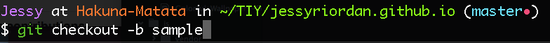

### Creating Branches in Terminal

Creating branched through terminal will make life much simpler (and faster) if you are using your GitHub repositories locally. It will mean that you do don't have to constantly be switching between your terminal and your browser. It is very simple.

Step 1: Have your terminal opened to the repository that you want to work on.

Step 2: Type the following into your terminal.

checkout = will automatically switch to the branch in terminal

-b = makes a new branch title

sample = name of my new branch

Once you have made changes to the branch you can push that to GitHub. 
