## Merge Conflicts?!?

Have you ever received this message when trying to merge your fork with another fork on Github?

Well here is the solution!

**Step 1: Click the big green button**

**Step 2: Name that Merge**

  *Click that green button again
  * * 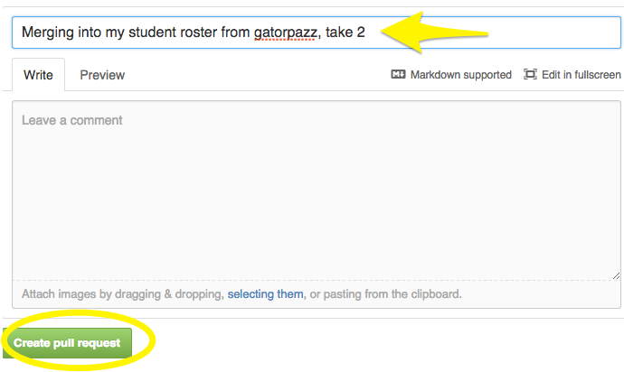
  * Oh no! Can't automatically merge.... however will we fix this?
  * 

Now let's move to the Command Line to help with the rest.

* 
* 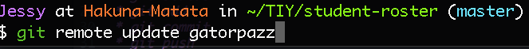
* 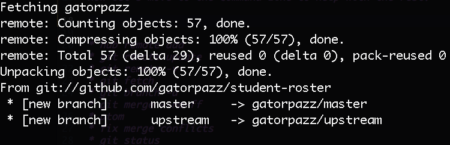
* 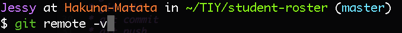
* 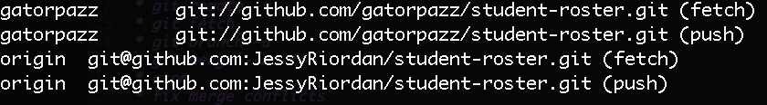
* 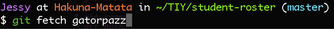
* 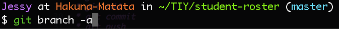
* 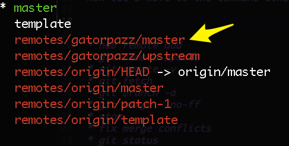
* 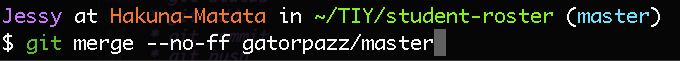
* 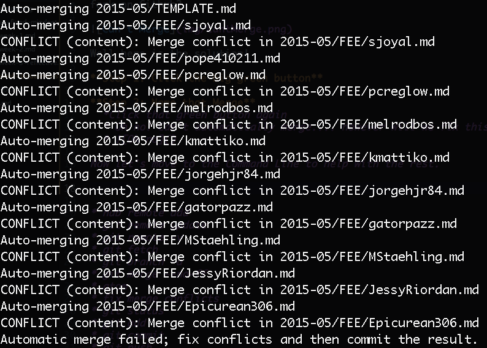
* 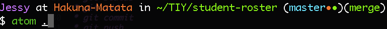
* 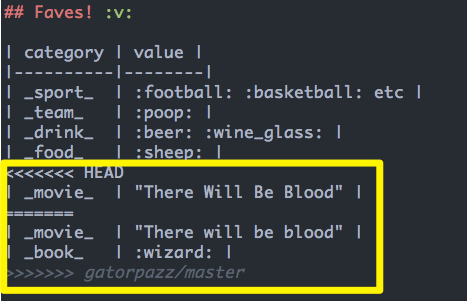
* 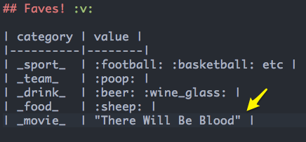
* 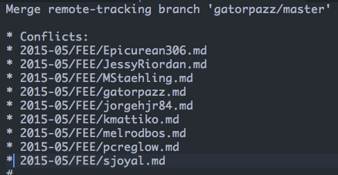
* 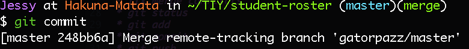
* 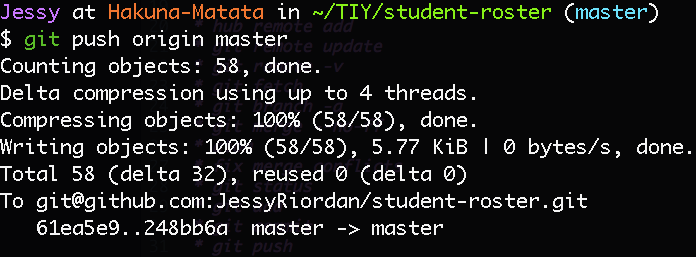
* 
* 

* hub remote add
* git remote update
* git remote -v
* git fetch
* git branch -a
* git merge --no-ff
* atom
* fix merge conflicts
* git status
* git add
* git commit
* git push
* git remote rm
*
