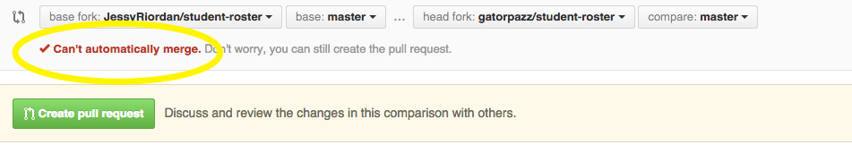

## Outline

Merge Conflicts:
* hub remote add
* git remote update
* git remote -v
* git fetch
* git branch -a
* git merge --no-ff
* atom
* fix merge conflicts
* git status
* git add
* git commit
* git push
* git remote rm
*

