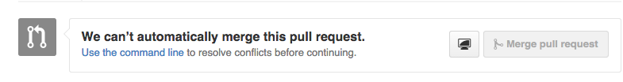
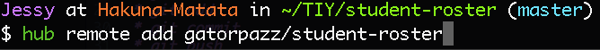

## Merge Conflicts?!?

Have you ever received this message when trying to merge your fork with another fork on Github?

Well here is the solution!

**Step 1: Click the big green button**

**Step 2: Name that Merge**

  * Click that green button again
   

  * Oh no! Can't automatically merge.... however will we fix this?
   

Now let's move to the Command Line to help with the rest.

**Step 3: Hub Remote Add**

  * You will need to hub remote add the repository that you want to work with. 
   

**Step 4: Git Remote Update**

  * Now you should git remote update.
   

  * Once enter is pressed the following should show up. 
   

**Step 5: Checking on our Remotes** 

  * Let's check on our remotes.
   
   
  * Once you hit enter it should look something like this.
   

**Step 6: Fetching**

  * Let's fetch!
   

**Step 7: Branches**

 * Let's check on what branches we can use.
   

 * Once you hit enter, it should look something like this.
   

**Step 8: Merging (the start)**

 * Now let's try to merge our branches.
   

 * Oh no! CONFLICTS!
   

**Step 9: Fixing Conflicts in Atom**

 * Open the conflicts in Atom.
   
 
 * Here is an example of what the conflct will look like.
 * We want to fix anything that looks like this example. You can delete part of, combine, or delete all of the conflict.
   

 * Here is a fixed conflict.
   

**Step 10: git status, git add, git commit**

 * git status - just to see if we have fixed all of our conflicts
 * git add - add all of the files that you changed
 * git commit
   

 * We have a merge!
   

**Step 11: Push it!**

 * git push that merge
   

 * Now check that pull request in Github... just to make sure. :smile:
   

**Step 12: Removing that Remote**

 * Remove the remote from your computer. 
   

#DONE!

